# IT-Innovationseditor 2.0

**Projekt Softwaretechnik und Medieninformatik**

Daniel697994, Epharia, Leonhardit07, stkait04, GrumpyPants

Studiengang: Softwaretechnik und Medieninformatik  
Fakultät: Informationstechnik  
Hochschule Esslingen  
Wintersemester 2025/26

**Zeitraum:** 01.09.2025 – 28.2.2026

---

## Inhaltsverzeichnis

1. [Einleitung](#1-einleitung)
   - 1.1 [Problemstellung](#11-problemstellung)
   - 1.2 [Produktvision](#12-produktvision)
2. [Zielgruppe](#2-zielgruppe)
   - 2.1 [Rollen](#21-rollen)
   - 2.2 [Personas](#22-personas)
3. [Funktionsumfang](#3-funktionsumfang)
   - 3.1 [Funktionale Anforderungen](#31-funktionale-anforderungen)
   - 3.2 [Nicht-funktionale Anforderungen](#32-nicht-funktionale-anforderungen)
   - 3.3 [Epics und User Stories](#33-epics-und-user-stories)
   - 3.4 [Bearbeitete User Stories](#34-bearbeitete-user-stories)
4. [User Interface / Benutzeroberfl&auml;che (UI) Entwürfe](#4-user-interface--benutzeroberfläche-ui-entwürfe)
   - 4.1 [Einführung](#41-einführung)
   - 4.2 [Editor](#42-editor)
   - 4.3 [Alternatives Design](#43-alternatives-design)
5. [Technisches Konzept](#5-technisches-konzept)
   - 5.1 [Kontextabgrenzung](#51-kontextabgrenzung)
   - 5.2 [Architektur](#52-architektur)
6. [Projektmanagement](#6-projektmanagement)
7. [Zeitmanagement](#7-zeitmanagement)
8. [Frontend](#8-frontend)
9. [Backend](#9-backend)
10. [Installationsanleitung](#10-installationsanleitung)
11. [Reflektion](#11-reflektion)
12. [Ausblick](#12-ausblick)

---

## Abbildungsverzeichnis

| Abbildung | Beschreibung |
|-----------|-------------|
| Abb. 2.1 | Persona Student Martin |
| Abb. 2.2 | Persona Professorin Stefanie |
| Abb. 2.3 | Persona Administratorin Luisa |
| Abb. 2.4 | Persona Dekan Thomas |
| Abb. 4.1 | UI Entwurf Einführung |
| Abb. 4.2 | UI Entwurf Editor |
| Abb. 4.3 | UI Entwurf Editor reduziert |
| Abb. 4.4 | UI Entwurf Alternatives Design |
| Abb. 5.1 | Kontextabgrenzung |
| Abb. 5.2 | Struktursicht als Komponentendiagramm |
| Abb. 5.3 | Laufzeitsicht als Sequenzdiagramm |
| Abb. 5.4 | Verteilungssicht als Verteilungsdiagramm |
| Abb. 5.5 | API Spezifikation Ausschnitt |
| Abb. 5.6 | Physisches Datenmodell (ER-Diagramm) |
| Abb. 8.1 | Editor Prototyp |
| Abb. 8.2 | Frontend-Struktur |
| Abb. 8.3 | Editor Final |
| Abb. 9.1 | Get-Response für User mit ID 1 |
| Abb. 9.2 | Get-Error für den User ohne ID in der Datenbank |
| Abb. 9.3 | Backend-Struktur |

---

## Tabellenverzeichnis

| Tabelle | Beschreibung |
|---------|-------------|
| Tab. 7.1 | Aufwandsschätzung |
| Tab. 7.2 | Aufwandsauflistung |
| Tab. 9.1 | Zuordnung der Personas zu Keycloak-Rollen und Benutzern |

---

## Acronymauflistung

| Kürzel | Bedeutung |
|--------|-----------|
| App | Applikation |
| CORS | Cross-Origin Resource Sharing |
| CSRF | Cross-Site Request Forgery |
| DoD | Definition of Done |
| DTO | Daten Transfer Objekt |
| FR | funktionale Anforderungen |
| HSE | Hochschule Esslingen |
| JWT | JSON Web Token |
| KI | Künstliche Intelligenz |
| NFR | nicht-funktionale Anforderungen |
| OIDC | OpenID Connect |
| PDF | Portable Document Format |
| UI | User Interface / Benutzeroberfläche |

---

## 1 Einleitung

Die Einleitung bietet einen Überblick über die Problemstellung und die daraus abgeleitete Produktvision des Projekts.

### 1.1 Problemstellung

Die Fakultät Informatik und Informationstechnik der Hochschule Esslingen (HSE) möchte, dass alle Absolvierenden Berichte über ihre Abschlussarbeiten verfassen. Diese werden anschließend zu einem Buch zusammengefasst und veröffentlicht. Bislang wurde hierfür der hauseigene IT-Innovationseditor V1.0 verwendet, der es Absolvierenden ermöglicht, mit festgelegter Formatierung besagte Berichte zu erstellen. Für die Administration stellt der IT-Innovationseditor V1.0 mehrere Verwaltungsmöglichkeiten zur Verfügung.

Die Version 1.0 ist in ihrer Verwendung aus Sicht der Verfassenden eher umständlich und bietet wenige Funktionen. Die Administration gestaltet sich ebenso umständlich und komplex. Sie basiert auf der Skriptsprache PHP und wurde nicht oder nicht ausreichend dokumentiert.

Ziel dieser Arbeit ist es, eine Version 2.0 des Editors zu entwerfen und erstellen. Sie soll für die Verfassung und Verwaltung von IT-Innovationen Artikeln verwendet werden. Dabei soll besonders die User Experience der Verfassenden und Administrierenden verbessert werden. Das Ergebnis dieser Arbeit soll nachhaltig die Fakultät und Hochschule verbessern und optimieren.

### 1.2 Produktvision

Der IT-Innovationseditor V2.0 ist für Studierende, die ihre Abschlussarbeit geschrieben haben, eine Erleichterung zur Erstellung ihrer Kurzfassung für die IT-Innovationen Zeitschriftenreihe. Er bietet eine übersichtliche, leicht bedienbare UI und eine Vorschau der generierten Portable Document Format (PDF) im Editor-Fenster.

Für Administrierende erleichtert die V2.0 die Verwaltung mit einer leicht bedienbaren und gut strukturierten UI. Im Vergleich zur V1.0 ist die Verwaltung von Personen, Rechten, Artikeln und Bearbeitungszeiträumen weniger zeitaufwändig.

---

## 2 Zielgruppe

Dieses Kapitel beschreibt die Zielgruppe des Projekts. Dazu werden die beteiligten Rollen identifiziert und im Anschluss anhand von Personas näher charakterisiert.

### 2.1 Rollen

Folgend werden die Rollen und ihre Aufgaben mit dem Produkt aufgeführt.

#### 2.1.1 Studierende

Die Studierenden sollen Kurzfassungen ihrer Abschlussarbeiten erstellen und anpassen können. Dafür sollen sie Quellen und Bilder hinterlegen und referenzieren können. Weitere Angaben wie beispielsweise erst-prüfende Personen oder das Unternehmen, in dem die Arbeit verfasst wurde, sollen von den Studierenden getätigt werden können.

#### 2.1.2 Professoren und Professorinnen

Die Professoren und Professorinnen sollen die Verfassungen, welche ihnen von Studierenden zugewiesenen wurden, einsehen können.

#### 2.1.3 Administrierende

Administrierende Personen sollen Bearbeitungszeiträume festlegen und editieren können. Dies soll auch für einzelne Personen möglich sein. Außerdem sollen sie Einsicht in alle bestehenden Verfassungen besitzen.

#### 2.1.4 Dekanat

Das Dekanat soll eine Übersicht über alle Verfassungen einschließlich ihrer Verfassenden besitzen. Zudem soll die Präambel des jeweiligen IT-Innovationen Bandes bearbeitet werden können.

### 2.2 Personas

Für jede der oben aufgeführten Rollen wurde eine Persona verfasst, um das Verständnis der Zielgruppen zu erweitern.

#### 2.2.1 Studierende


*Abbildung 2.1: Persona Student Martin [1]*

Martin ist ein 24-jähriger Softwaretechnik-Student an der Hochschule Esslingen, der vor kurzem seine Bachelorarbeit fertiggestellt hat. Seine organisierte Art half ihm dabei, auf effiziente und ordentliche Weise seine Arbeit zu schreiben. Er legt nicht nur bei seinen eigenen Vorhaben Wert auf ordentliche Strukturen und klare Abläufe, sondern auch bei Produkten und Dienstleistungen, die er dafür nutzt.

**Ziele**
- Verfassen eines Artikels über seine Bachelorarbeit
- Den Überblick über seine verwendeten Quellen und Grafiken behalten

**Bedürfnisse**
- Eine übersichtliche UI mit klarer Navigation
- Getrennte Funktionen für verschiedene Zwecke
- Reibungslose und effiziente User Experience

**Probleme**
- Richtlinien und Verwendung des Editors sind nicht sehr deutlich
- Einsehen der PDF-Version ist umständlich und zeitaufwändig

**Wie könnte eine Version 2.0 helfen?**

Die Neuentwicklung stellt Martin die verfügbaren Funktionen des Editors klarer und einfacher zugänglich zur Verfügung. Des Weiteren wird der Fortschritt zwischengespeichert, auch wenn nicht explizit gespeichert wird. Die Inklusion einer Vorschau zeigt ihm jederzeit, wie die generierte PDF aussehen wird.

#### 2.2.2 Professoren und Professorinnen


*Abbildung 2.2: Persona Professorin Stefanie [1]*

Stefanie ist eine 43-jährige Professorin an der Hochschule Esslingen, die unter anderem Mensch-Computer-Interaktion lehrt. Mit ihrer analytischen Art legt sie großen Wert auf ein sauberes Design und gute User Experience, auch wenn sie nur flüchtig mit einem Produkt interagiert.

**Ziele**
- Einsehen der ihr zugeordneten Artikel

**Bedürfnisse**
- Übersichtliche Darstellung aller für sie relevanten Artikel
- Klare UI ohne unnötige Details

**Probleme**
- Die Artikel müssen heruntergeladen werden, um eingesehen zu werden

**Wie könnte eine Version 2.0 helfen?**

Die Implementierung einer Vorschau ersetzt das Herunterladen der Artikel.

#### 2.2.3 Administrierende


*Abbildung 2.3: Persona Administratorin Luisa [1]*

Luisa ist eine 33-jährige Administratorin an der Hochschule Esslingen. Sie verwaltet mehrere interne Systeme der Hochschule gewissenhaft und ordentlich. Dabei legt sie viel Wert auf Übersichtlichkeit und effiziente Arbeitsabläufe.

**Ziele**
- Festlegung der Bearbeitungszeiträume, manchmal auch pro Person
- Erstellung, Bearbeitung und Zuweisung von Personen im System
- Wartungsarbeiten und Systemupdates, um den Editor stets aktuell zu halten

**Bedürfnisse**
- Übersichtliche Darstellung aller für die Verwaltung zuständigen Funktionen
- Sichere und effiziente Interaktion mit dem System
- Detaillierte Dokumentation und Tools zur Fehlerdiagnose
- Bearbeitungsrechte von allen Kurzfassungen

**Probleme**
- Verantwortung für die Stabilität und Verfügbarkeit des Systems
- Wartung gestaltet sich schwierig, da keine Dokumentation vorhanden ist
- Verwaltung ist komplex und unübersichtlich

**Wie könnte eine Version 2.0 helfen?**

Bei der Entwicklung wird von Beginn an ausführlich dokumentiert, um spätere Fehlerbehebungen und Wartungsarbeiten zu erleichtern. Bei der Menüführung wird auf Übersichtlichkeit und Struktur geachtet, um die Verwaltung zu erleichtern.

#### 2.2.4 Dekanat


*Abbildung 2.4: Persona Dekan Thomas [1]*

Thomas ist ein 52-jähriger Dekan der Hochschule Esslingen. Er ist in seiner Position vielbeschäftigt und möchte deshalb auftretende Aufgaben effizient bearbeiten. Zudem zeigt er viel Engagement und ein hohes Maß an Kreativität. Thomas' Beruf ist gleichzeitig seine Berufung. Deshalb freut er sich jedes Jahr, wenn er mehr über den Stand der Studierenden im Rahmen der IT-Innovationen Artikel erfahren kann.

**Ziele**
- Verfassen einer Präambel für IT-Innovationen
- Übersicht über alle Verfassenden
- Einsicht in die kombinierte Vorschau aller Kurzfassungen

**Bedürfnisse**
- Einfaches Erstellen der Präambel, ohne die Formatierung beachten zu müssen
- Einfacher Zugriff auf die generierte PDF aus allen Beiträgen

**Probleme**
- Vorschau der Präambel ist nicht ohne Weiteres einsehbar

**Wie könnte eine Version 2.0 helfen?**

Der verbesserte Editor bietet die Möglichkeit die Präambel, inklusive korrekter Formatierung, als Vorschau darzustellen.

---

## 3 Funktionsumfang

Der Funktionsumfang ist in funktionale Anforderungen (FR), nicht-funktionale Anforderungen (NFR) und Epics gegliedert und beschreibt den vollständigen Funktionsumfang des Projektes.

### 3.1 Funktionale Anforderungen

Zu den funktionalen Anforderungen zählen alle Anforderungen, welche die User bei der Verwendung der Applikation (App) nutzen.

#### 3.1.1 Allgemein

- Status einer Kurzfassung einsehen
- Wenn Bearbeitungszeitraum endet und Status offen ist, wird eine Benachrichtigung per Mail versandt
- Text zweispaltig pro Blatt, Bilder eine oder zwei Spalten breit
- Code Blöcke mit Hervorhebung der Syntax einbinden
- Kurzfassung in PDF-Datei konvertieren
- Zwischenstände der Kurzfassungen versionieren (1.-, X.-, letzte Abgabe)

#### 3.1.2 Rolle Studierende

- Anmelden mit HSE-Account
- Kurzfassung erstellen und editieren
- Kurzfassung einem Professor oder Professorin zuweisen
- Informationsseite mit Instruktionen und Hinweisen
- Flag zur Markierung von potenziell vertraulichen Inhalten
- Angepasste Formatierungen für Deutsch und Englisch
- Grafiken hochladen und im Text referenzieren
- PDF der Kurzfassung als Vorschau erzeugen und einsehen

#### 3.1.3 Rolle Administration

- User anlegen und verwalten
- Bearbeitungszeiträume festlegen (allgemein/einzeln)
- Alle Kurzfassungen einsehen und editieren

#### 3.1.4 Rolle Professoren und Professorinnen

- Zugewiesene Kurzfassungen einsehen (Lesezugriff)

#### 3.1.5 Rolle Dekan

- Präambel bearbeiten
- Übersicht aller Verfassenden einsehen

### 3.2 Nicht-funktionale Anforderungen

NFR haben eine große Auswirkung auf die User, da diese mit der User Experience zusammen hängen. Nachfolgende NFR sind in absteigender Priorität aufgeführt.

#### 3.2.1 Vollständige Dokumentation

Eine vollständige Dokumentation ist essenziell, damit sich nach Abschluss des initialen Projektes andere Personen schnell einarbeiten und die getroffenen Entscheidungen verstehen können. Sie hilft bei der Einarbeitung in das Projekt und hält fest, warum etwas in der vorliegenden Weise umgesetzt wurde. So können Entscheidungen später nachvollzogen oder neu evaluiert werden. Wird später die Anwendung weiter entwickelt oder verändert, so muss dies auch in der Dokumentation festgehalten werden. Erreicht wird dies durch eine ständige Dokumentation aller implementierten Features. Veränderungen des Quellcodes werden in GitHub mittels der Commit-Nachricht festgehalten.

#### 3.2.2 Skalierbarkeit

Damit die App auch in der Zukunft performant bleibt, soll diese skalierbar sein. Dies soll durch die Verwendung einer Microservice Architektur ermöglicht werden, sodass rechenintensive Services parallel gestartet werden können. Somit kann bei höheren Auslastungen eine Überlastung des Systems vorgebeugt werden.

#### 3.2.3 Übersichtlichkeit

Für eine gute User Experience soll die App strukturiert und übersichtlich gestaltet sein. Dies ist sowohl für die Rolle der Studierenden, als auch der Administrierenden von Bedeutung, den beiden Haupt-Usergruppen, welche den größten Anteil der Nutzungszeit ausmachen werden. Hierfür wird sich an gängigen Richtlinien für die UI orientiert.

#### 3.2.4 Intuitive Bedienung

Neben der Übersichtlichkeit soll auch eine intuitive Bedienung ermöglicht werden. Dies kann durch die Verwendung gängiger Symbolik und geläufiger Platzierung von Interaktionselementen geschehen.

#### 3.2.5 Hohe Codequalität

Eine hohe Codequalität erleichtert die Lesbarkeit des Codes und macht ihn leichter verständlich. Hierfür sind aussagekräftige Benennungen von Variablen und Funktionen wichtig.

#### 3.2.6 Vertrauen

Das Vertrauen der User wird durch die Verwendung externer Authentifizierung teilweise ausgelagert. Hier gilt es die Verknüpfung zu externen Authentifizierungsservices sicher zu gestalten. Auch die Daten der eigenen Anwendung müssen sicher vermittelt und gespeichert werden.

### 3.3 Epics und User Stories

Aus den oben genannten Anforderungen wurden Epics verfasst und User Stories untergeordnet.

#### 3.3.1 Epic 1: Kurzfassungsverwaltung für Studierende

Studierende können ihre Kurzfassung erstellen, bearbeiten und einreichen.

- **User Story 1:** Als Studierender möchte ich eine Kurzfassung erstellen, um meine Abschlussarbeit in der IT-Innovationen-Ausgabe vorstellen zu können.
- **User Story 2:** Als Studierende möchte ich Grafiken und Quellen hochladen, um diese in meiner Kurzfassung referenzieren zu können.
- **User Story 3:** Als Studierender möchte ich aus dem Markdown-Quelltext eine PDF generieren, um eine Vorschau meiner Kurzfassung zu sehen.
- **User Story 4:** Als Studierende möchte ich eine Flag setzen, um potenziell vertrauliche Inhalte zu markieren.
- **User Story 5:** Als Studierender möchte ich meiner Kurzfassung eine Professorin oder einen Professor zuweisen, um Feedback zu ermöglichen.

#### 3.3.2 Epic 2: Bearbeitungszeiträume und Statusmanagement

Die Anwendung verwaltet den Lebenszyklus einer Kurzfassung (Bearbeitungszeitraum, Status, Benachrichtigungen).

- **User Story 6:** Als Administrator möchte ich Bearbeitungszeiträume festlegen, um Verfassenden ein Zeitlimit vorzugeben und ggf. für Einzelpersonen zu verlängern.
- **User Story 7:** Als Studierender möchte ich den Status meiner Kurzfassung einsehen, um zu wissen, ob sie offen, eingereicht oder abgeschlossen ist.
- **User Story 8:** Wenn der Bearbeitungszeitraum endet und der Status „offen" ist, soll automatisch eine E-Mail-Benachrichtigung versendet werden.

#### 3.3.3 Epic 3: Authentifizierung und Benutzerverwaltung

Sichere Verwaltung von Usern und Zugriffsrechten unter Verwendung externer Authentifizierungsdienste (HSE-Account).

- **User Story 9:** Als Studierender möchte ich mich mit meinem HSE-Account anmelden, um auf meine Kurzfassung zugreifen zu können.
- **User Story 10:** Als Administrator möchte ich User anlegen und bearbeiten, um neue User hinzuzufügen und deren Rechte zu verwalten.
- **User Story 11:** Als Administrator möchte ich Rollen zuweisen (Studierende, Professor, Dekan), um unterschiedliche Zugriffsrechte zu gewähren.

#### 3.3.4 Epic 4: Rollenbasierter Zugriff

Unterschiedliche Rollen haben spezifische Berechtigungen und Ansichten.

- **User Story 12:** Als Professor möchte ich mir zugewiesene Kurzfassungen einsehen, um einen Überblick über deren Fortschritt zu erhalten.
- **User Story 13:** Als Administratorin möchte ich Zugriffsrechte auf alle Kurzfassungen haben, um diese einsehen und bearbeiten zu können.
- **User Story 14:** Als Dekan möchte ich eine Übersicht aller Verfassenden einsehen, um den Gesamtüberblick zu behalten.

#### 3.3.5 Epic 5: Formatierung und Dokumenterstellung

Die Kurzfassung soll professionell formatiert und in PDF-Form exportierbar sein.

- **User Story 15:** Als Studierender möchte ich, dass der Text zweispaltig pro Blatt angezeigt wird, um den formalen Anforderungen zu entsprechen.
- **User Story 16:** Als Studierender möchte ich, dass Bilder eine oder zwei Spalten breit eingebettet werden können, um die Formatierung zu steuern.
- **User Story 17:** Als Studierender möchte ich Codeblöcke mit Syntax-Highlighting einfügen, um Quellcode sauber darzustellen.
- **User Story 18:** Als Studierender möchte ich eine PDF-Vorschau erzeugen, um das Endergebnis prüfen zu können.
- **User Story 19:** Als Studierender möchte ich zwischen Deutsch und Englisch passende Formatierungen auswählen, um sprachspezifische Layouts einzuhalten.
- **User Story 20:** Als Dekan möchte ich die Präambel bearbeiten, um für jede Ausgabe eine neue Einleitung zu verfassen.

#### 3.3.6 Epic 6: Informations- und Kommunikationsfunktionen

Hilfeseiten, Instruktionen und Kommunikationsfunktionen für Nutzende bereitstellen.

- **User Story 21:** Als Studierende möchte ich eine Informationsseite öffnen, um Hilfestellungen zu erhalten.
- **User Story 22:** Als System möchte ich automatische Benachrichtigungen per E-Mail versenden, wenn der Bearbeitungszeitraum endet oder eine neue Zuweisung erfolgt.

### 3.4 Bearbeitete User Stories

Vollständig umgesetzt wurden die **User Stories 1, 2, 4, 5, 7, 9, 17, 21**.

Teilweise umgesetzt wurden die **User Stories 16 und 19**.

---

## 4 User Interface / Benutzeroberfläche (UI) Entwürfe

Dieses Kapitel zeigt die UI Entwürfe des Projekts: zunächst an das bestehende Layout angelehnte Designs, gefolgt von einem alternativen Entwurf.

### 4.1 Einführung

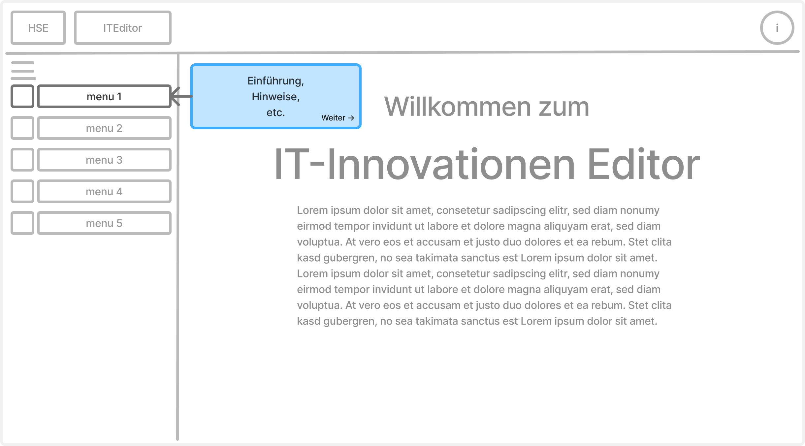

*Abbildung 4.1: UI Entwurf Einführung*

In Abbildung 4.1 ist ein Entwurf des Einführungsassistenten zu sehen, der beim erstmaligen Betreten der Webseite präsentiert wird. Das hervorgehobene Textfeld soll kurz den Aufbau der Webseite und die vorhandenen Funktionen beschreiben, um Usern einen schnelleren Einstieg zu ermöglichen. Über Buttons im Textfeld können User eigenständig die Einführung steuern oder überspringen.

### 4.2 Editor

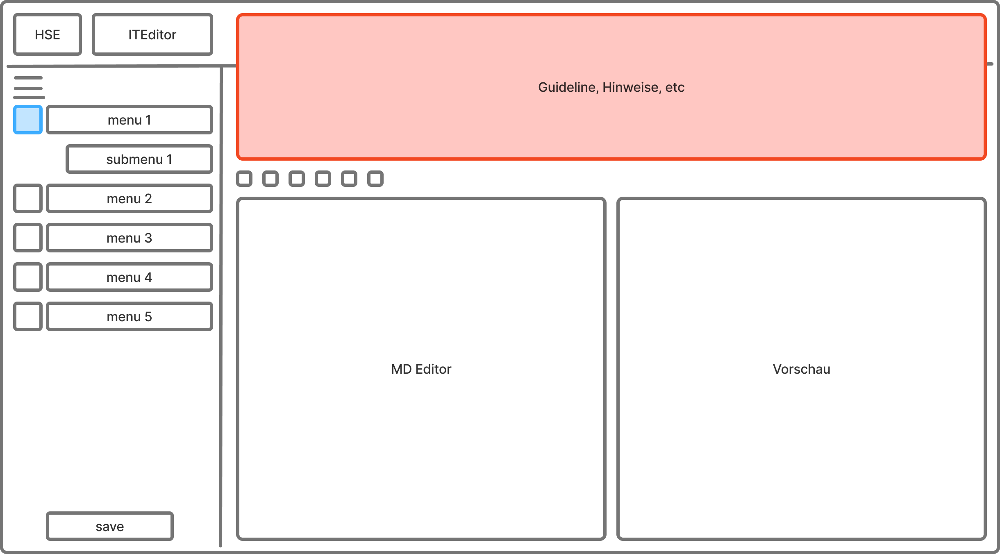

*Abbildung 4.2: UI Entwurf Editor*

In Abbildung 4.2 ist ein Entwurf des Editors zu sehen. Der Hauptteil des Fensters wird für den Markdown-Editor und die kompilierte Vorschau verwendet. Im Editor kann direkt Markdown-Syntax eingegeben werden. Für eine einsteigerfreundliche Verwendung des Editors werden Buttons, beispielsweise für das Einfügen von Grafiken oder Quellenreferenzen, bereitgestellt. Auf der linken Seite des Fensters befindet sich eine Menüleiste, mit der sich zwischen den verschiedenen Funktionen wechseln lässt. Am oberen Rand lassen sich Hilfestellungen, stilistische Vorgaben und mehr einblenden (hier zu sehen im eingeblendeten Zustand). Dabei verschieben sich der Editor, die Vorschau und relevante Buttons nach unten, damit der Arbeitsfluss nicht gestört wird.

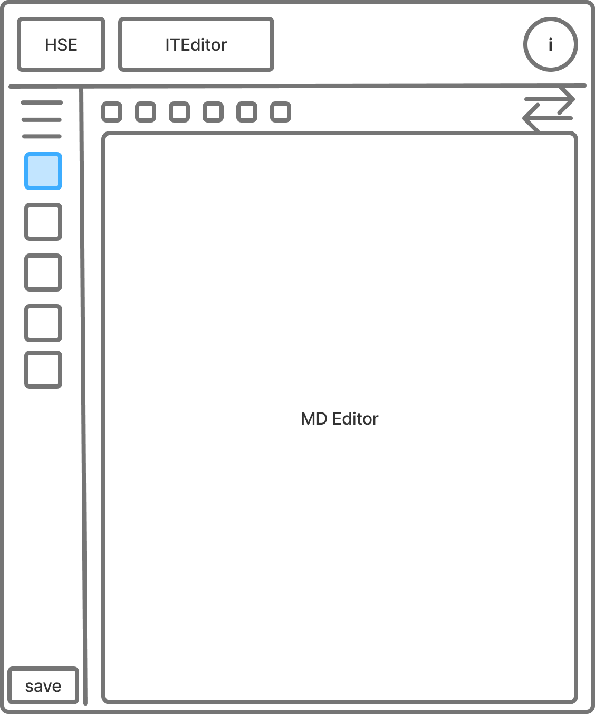

*Abbildung 4.3: UI Entwurf Editor reduziert*

In Abbildung 4.3 ist ein Entwurf des Editors zu sehen, wenn die Fensterbreite eingeschränkt ist. Dabei wird die Vorschau ausgeblendet und das Menüband reduziert. Zwischen dem Editor und der Vorschau lässt sich über einen Button wechseln. Die Menüleiste kann bei Bedarf wieder ausgeklappt werden.

### 4.3 Alternatives Design

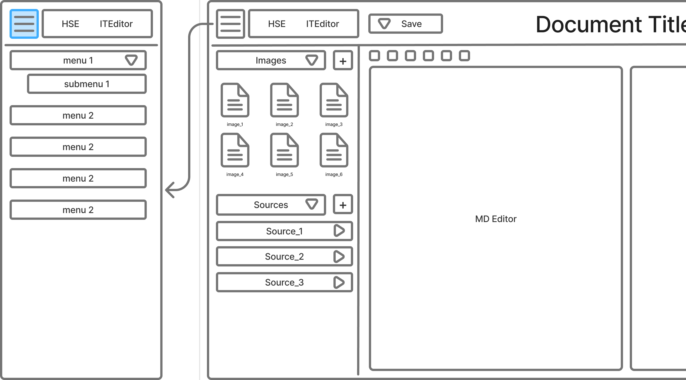

*Abbildung 4.4: UI Entwurf Alternatives Design*

In Abbildung 4.4 ist ein Entwurf des Editors mit einer alternativen Designphilosophie zu sehen. Hier wird, im Gegensatz zu den vorherigen Entwürfen, versucht, Menüwechsel zu reduzieren. Die linke Seite wird hier für eine Übersicht aller hochgeladenen Quellen und Grafiken verwendet. Das Erstellen von Quellen und das Hochladen der Grafiken erfolgt ebenfalls dort. Die Menüleiste kann bei Bedarf über einen Button oben links eingeblendet werden, dann übernimmt sie temporär die linke Seite.

---

## 5 Technisches Konzept

Dieses Kapitel beschreibt das technische Fundament des Projekts und bildet die Grundlage für die Umsetzung und das Zusammenspiel der Systemkomponenten.

### 5.1 Kontextabgrenzung

Eine Kontextabgrenzung dient der Übersicht des gesamten Projekts. Abbildung 5.1 zeigt die Kontextabgrenzung für das Projekt. Durch die drei Bereiche **System**, **Systemkontext** und **Umgebung** kann man das Zusammenspiel verschiedener Elemente nachvollziehen. Dadurch entsteht eine Grundlage, um Schnittstellen zu identifizieren und deren Umsetzung zu planen. Zudem können auf dieser Basis die im System ablaufenden Vorgänge geplant und analysiert werden. Darüber hinaus unterstützt die Kontextabgrenzung die Kommunikation zwischen den beteiligten Stakeholdern und trägt zur frühzeitigen Erkennung von Missverständnissen und Risiken bei. Sie bildet damit die Grundlage für die weiteren Architektursichten.

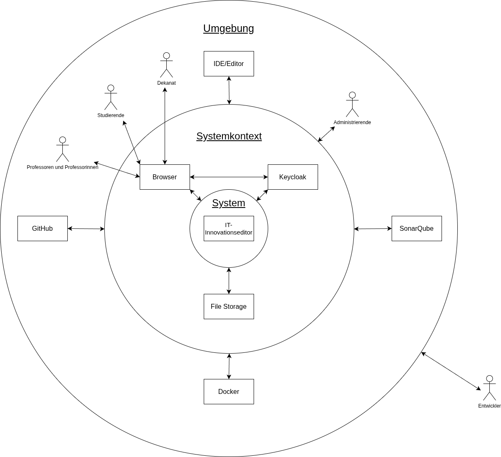

*Abbildung 5.1: Kontextabgrenzung*

### 5.2 Architektur

Die Web-App wird nach dem Architekturmuster der Microservice-Architektur implementiert und ist als Client-Server-Anwendung konzipiert. Sie beinhaltet die Schlüsselkomponenten einer Drei-Schichten-Architektur bestehend aus: Frontend, Backend und Datenbank. Die Entscheidung für eine Microservice-Architektur bietet mehrere Vorteile:

- **Unabhängige Modulverteilung:** Jedes Modul läuft in einem eigenen Docker-Container, wodurch unabhängige Entwicklung und einfache Wartbarkeit möglich sind.
- **Skalierbarkeit und Performance:** Services können unabhängig voneinander horizontal skaliert werden. Dies erhöht die Performance und erleichtert die Erweiterbarkeit.
- **Flexibilität und Wandelbarkeit:** Änderungen können gezielt in einzelnen Services vorgenommen werden, ohne das Gesamtsystem zu beeinträchtigen.
- **Teamorganisation:** Aufgaben können klar auf verschiedene Teams verteilt werden.
- **Optimierung von CI/CD-Pipelines:** Die modulare Struktur erleichtert kontinuierliche Integration und Bereitstellung.
- **Dezentrales Management:** Services können unabhängig verwaltet werden.

**Technologischer Stack:**

- **Frontend:** Angular, Frontend-Framework für JavaScript
- **Backend:** Spring Boot, Backend-Framework für Java
- **Datenbank:** PostgreSQL, Objekt-relationale Datenbank
- **Weitere Komponenten:** Traefik als Reverse Proxy, Keycloak als Authentication Service von einem externen Server, RabbitMQ als Message Queue/Broker, ein File Storage sowie beliebig viele PDF-Services (Worker)

Die Auswahl der Technologien basiert auf bisherigen Projekterfahrungen innerhalb der Institution, den vorhandenen Kenntnissen der betreuenden und entwickelnden Personen sowie auf bewährten Praktiken.

#### 5.2.1 Architektursichten

Die zuvor dargestellte Kontextabgrenzung dient als Überblick des Gesamtsystems und stellt die externe Abhängigkeit sowie die Hauptkomponenten dar. Darauf aufbauend lassen sich die nachfolgenden Architektursichten ableiten.

- Die **Struktursicht** gibt einen Überblick über die internen Systemkomponenten selbst.
- Die **Laufzeitsicht** beschreibt die Interaktionen zwischen dem System und seinem Umfeld.
- Die **Verteilungssicht** zeigt die physische beziehungsweise infrastrukturelle Aufteilung der Komponenten und deren Kommunikation.

Diese Sichten ermöglichen es, Schnittstellen zu definieren und die Art des Deployments darzustellen.

**Struktursicht**

Das Komponentendiagramm in Abbildung 5.2 zeigt die zentralen Bestandteile des Systems und deren Zusammenspiel. Zu erkennen sind Frontend, Backend, Datenbank, Message Queue/Broker, PDF-Worker sowie der Reverse Proxy, die gemeinsam die Anwendungslogik des Systems ausmachen.

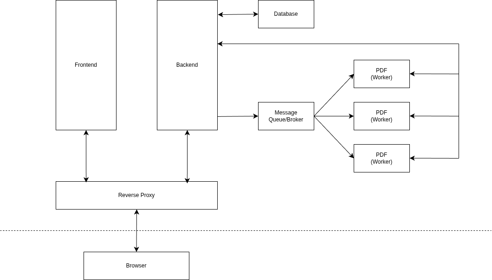

*Abbildung 5.2: Struktursicht als Komponentendiagramm*

**Laufzeitsicht**

In dieser Sicht wird der Standardablauf eines typischen User-Use-Cases aufgezeigt. Das in Abbildung 5.3 gezeigte Sequenzdiagramm enthält die bereits in der Struktursicht definierten Systemkomponenten sowie zusätzliche Elemente aus dem Systemkontext, wie etwa den Authentication Service (Keycloak). Aus Gründen der Übersichtlichkeit wurde der File Storage in diesem Diagramm weggelassen. Das Diagramm zeigt insbesondere die Kommunikation zwischen Browser und System beim Aufrufen der App, dem Authentifizierungsvorgang und der anschließenden Interaktion mit dem Backend.

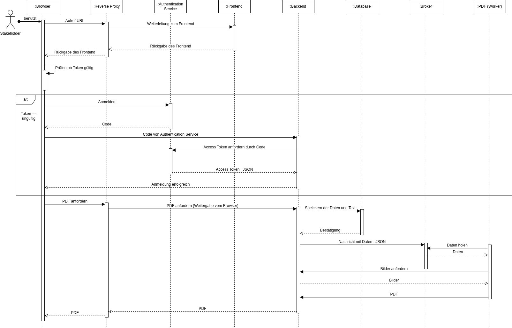

*Abbildung 5.3: Laufzeitsicht als Sequenzdiagramm*

**Verteilungssicht**

Die Verteilungssicht beschreibt die physische Aufteilung der Komponenten sowie die zwischen ihnen verwendeten Kommunikationstechnologien. Wie in Abbildung 5.4 dargestellt, werden sämtliche Microservices auf einem Produktionsserver in separaten Docker-Containern betrieben. Zusätzlich existiert ein externer Authentication Service (Keycloak) sowie ein angebundener File Storage. Die Kommunikation zwischen Browser, Reverse Proxy und den internen Services erfolgt über HTTPS, während die interne Service-Kommunikation, beispielsweise zwischen Backend, Message Broker und PDF-Worker, über interne Docker-Netzwerke abgewickelt wird.

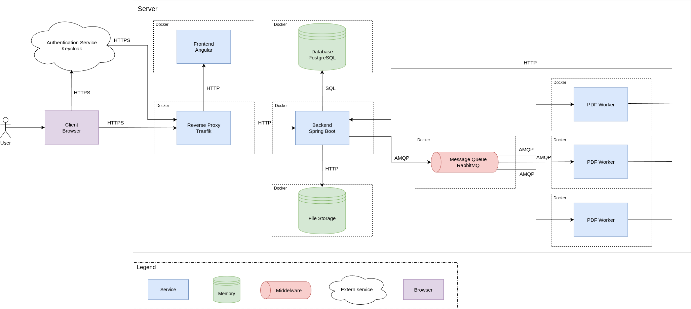

*Abbildung 5.4: Verteilungssicht als Verteilungsdiagramm*

#### 5.2.2 Schnittstellentechnologie

Die Schnittstellen werden nach der OpenAPI-3.0 Spezifikation ausgerichtet. In der Schnittstellendefinition, siehe Abbildung 5.5, werden der Pfad, die REST-Verben und die Struktur der Nachrichten festgehalten. Als Grundlage hierfür dient das Datenmodell und die Laufzeitsicht.

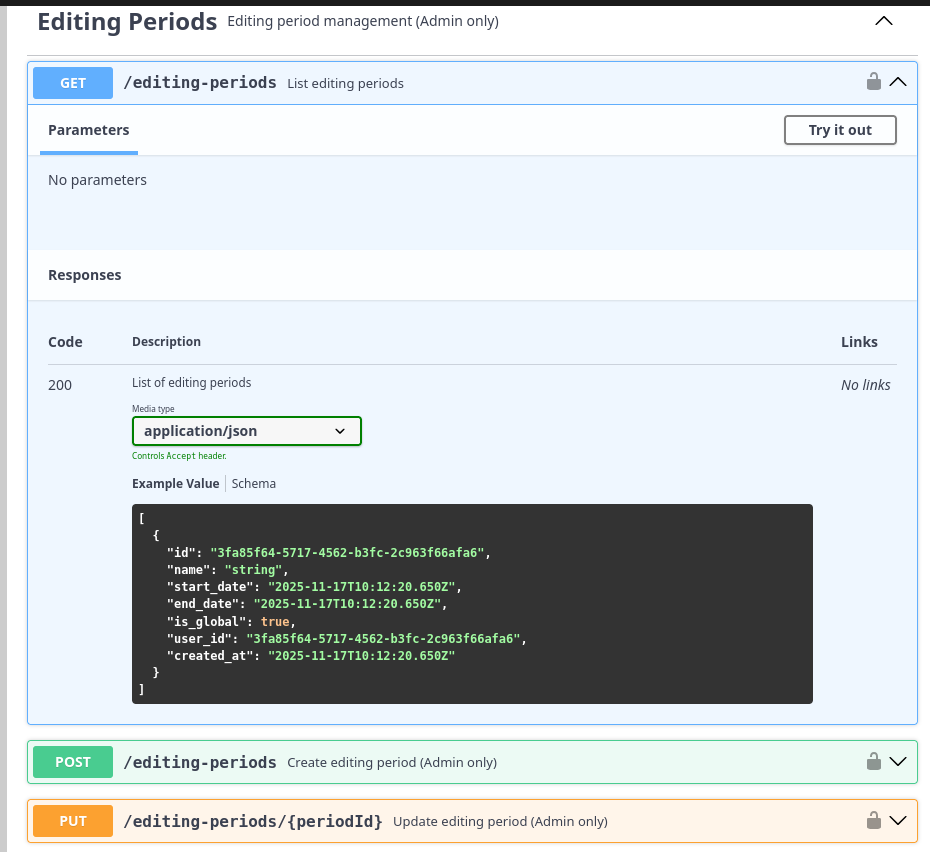

*Abbildung 5.5: API Spezifikation Ausschnitt*

Als Statuscodes wurden für eine bessere Übersichtlichkeit sechs Stück ausgewählt, welche in der App genutzt werden sollen:

1. **200:** Meldet die erfolgreiche Ausführung
2. **201:** Erklärt, dass ein Objekt erstellt wurde
3. **400:** Code für ungültige Anfragen
4. **401:** Statusrückmeldung, falls der Nutzer nicht angemeldet ist oder nicht die erforderlichen Rechte besitzt
5. **404:** Erklärt, dass die Anfrage gültig ist, das betroffene Element aber nicht vorhanden ist
6. **500:** Gibt dem User zurück, dass der Server interne Probleme hat und grade nicht antworten kann

Die vollständige API Dokumentation ist in GitHub hinterlegt. Für eine bessere Übersichtlichkeit kann der Swagger Editor genutzt werden. Dazu die yaml-Datei in den Editor laden.

#### 5.2.3 Datenmodell

[Datenmodell Link](/DB-Model/IT-Innovationseditor-V2_data-model.dbml)

Wie im Modell dargestellt, orientiert sich das Datenmodell an der 3. Normalform, ergänzt um moderne Ansätze für semi-strukturierte Daten. Dabei wurden folgende Designentscheidungen getroffen, um die FR performant abzubilden:

- **Hybride Datenhaltung (JSON):** Für die Quellenangaben (*sources*) wird der Datentyp JSONB (PostgreSQL) verwendet. Dies bricht bewusst die atomare Struktur auf, um eine hohe Flexibilität für unterschiedliche Zitationsstile (Attribute wie Autor, Jahr, ISBN) zu gewährleisten, ohne das Datenbankschema bei jeder Änderung migrieren zu müssen.
- **Externe Identitäten:** Die Tabelle `users` speichert keine sicherheitskritischen Daten wie Passwörter. Stattdessen wird über die `keycloak_id` (UUID) auf den externen Identity Provider referenziert.
- **Medien-Management:** Die Tabelle `images` speichert lediglich die Metadaten der hochgeladenen Bilder (Dateiname, MIME-Type, UUID). Die binären Bilddaten werden aus Performancegründen nicht in der Datenbank (als BLOB), sondern im Dateisystem des Servers abgelegt und über die Datenbank referenziert.
- **Versionierung:** Über eine 1:n-Beziehung zwischen `articles` und `article_versions` wird jeder Speicherstand eines Artikels historisiert. Dies ermöglicht einen Audit-Trail und das Wiederherstellen früherer Bearbeitungsstände.

---

## 6 Projektmanagement

Dieses Kapitel erläutert wie das Projekt geplant, organisiert und durchgeführt wird und wie sich das Projektteam organisiert.

### 6.1 Entwicklungsprozess

Für das Aufgabenmanagement wird in GitHub ein Projekt erstellt, in welchem Arbeitspakete als Issues angelegt werden. Die Issues können in GitHub ihren Bearbeitungsstatus verändern und sind in einem Board visualisiert.

Die Arbeitspakete werden den Projektmitgliedern zugewiesen und selbständig oder kollaborativ bearbeitet.

Die Projektgruppe spricht sich regelmäßig ab, so können herausfordernde Aufgaben neu bewertet und priorisiert werden. Die Absprachen dienen auch als Abgleich des Projektzeitplans mit dem aktuellen Fortschritt.

Eine Aufgabe wird mit einer Review durch ein weiteres Projektmitglied abgeschlossen. Ist ein Issue abgeschlossen, wird es in der Commit-Nachricht erwähnt und verändert durch die GitHub-Automatisierung seinen Status.

### 6.2 Versionsverwaltung

Zur Versionsverwaltung wird Git in GitHub verwendet. Auf GitHub werden die Projektdateien abgelegt und können später öffentlich geteilt werden. Features werden in Feature-Branches erarbeitet. Ist ein Feature erstellt und „fertig" (Definition of Done (DoD)), so wird der Feature-Branch in den Main-Branch integriert (Merge).

### 6.3 Besprechung

Die Besprechungen zwischen Kunde, Betreuer und Projektgruppe finden hybrid statt, vor Ort in der Hochschule und online. Vor den Besprechungen erhalten alle Teilnehmenden das Protokoll mit den anstehenden Themenpunkten. Nach der Besprechung wird das Protokoll ergänzt und den Teilnehmenden übermittelt. Das Protokoll hält das Besprochene fest und soll Missverständnissen oder Fehlinterpretationen vorbeugen.

### 6.4 Definition of Done

DoD: Eine Aufgabe oder ein Feature wird als abgeschlossen definiert, wenn es folgende Kriterien erfüllt:

1. Hinzugefügter Code hat alle lokalen Tests erfolgreich durchlaufen
2. Die dazugehörige Pull-Request wurde mit einem Review durch ein anderes Projektmitglied überprüft und freigegeben.
3. Das implementierte Feature wurde in der Projektdokumentation erfasst.

### 6.5 Kommunikation

Nachdem die Projektgruppe ihr Projekt „abgeschlossen" hat, findet die Kommunikation über GitHub statt.

### 6.6 Dokumente

Die Dokumentation wird in GitHub abgelegt.

### 6.7 Lizenz

Das Projekt wird unter der Apache Lizenz Version 2.0 veröffentlicht. Diese Lizenz erlaubt es der Hochschule Esslingen, welche die App einsetzen möchte, die Software nach Abschluss des Semesters individuell weiterzuentwickeln, anzupassen und auch in nicht-öffentlichen Projekten einzusetzen, ohne zur Offenlegung des Quellcodes verpflichtet zu sein.

Ein weiterer Vorteil gegenüber der GPLv3-Lizenz, die zur Wahl stand, besteht darin, dass auch Dritte die Software weiterentwickeln und in eigene Projekte integrieren dürfen, ohne dass daraus eine Verpflichtung zur Veröffentlichung des gesamten abgeleiteten Quellcodes entsteht. Dies erleichtert sowohl eine spätere kommerzielle Nutzung als auch Kooperationen mit externen Partnern.

---

## 7 Zeitmanagement

Folgend wird die zeitliche Aufteilung des Projektes näher betrachtet.

### 7.1 Aufwandsschätzung

Die folgende Abbildung 7.1 zeigt eine zusammengeführte Schätzung des benötigten Aufwandes in Stunden für die aufgelisteten Aufgabenbereiche.

| Bereich | Aufwand (h) |
|---------|-------------|
| Veranstaltungen | 237,5 |
| Organisation | 295 |
| Vorbereitung | 141 |
| Features | 910 |
| **GESAMTSUMME** | **1583,5** |

*Tabelle 7.1: Aufwandsschätzung*

Eine weiter herunter gebrochene Schätzung befindet sich im Repository.

### 7.2 Aufwandsauflistung

Im folgenden Bild 7.2 wird ersichtlich, wie sich der Arbeitsaufwand zusammengesetzt hat.

| Bereich | Aufwandsschätzung | Aufwandsauflistung | Ø pP |
|---------|------------------|--------------------|------|
| Veranstaltungen | 237,5 | 191 | 38,2 |
| Organisation | 295 | 272 | 54,4 |
| Vorbereitung | 141 | 252 | 50,4 |
| Features | 910 | 610 | 122 |
| **GESAMTSUMME** | **1583,5** | **1325** | **265** |

*Tabelle 7.2: Aufwandsauflistung*

Wie in den mittleren Spalten zu erkennen ist, wurde deutlich mehr Zeit für vorbereitende Aufgaben benötigt als geplant. Hieran ist klar zu erkennen, dass das Projektteam wenig praktische Erfahrung mit den eingesetzten Technologien hatte. Auch in der Zeile Veranstaltungen ist weniger Zeit eingetragen, was den später angesprochenen Mangel an Zusammenarbeit und Absprachen hervorhebt. Eine weiter herunter gebrochene Auflistung befindet sich im Repository.

---

## 8 Frontend

In diesem Kapitel werden der Prototyp sowie der finale Projektstand beschrieben.

### 8.1 Prototyp

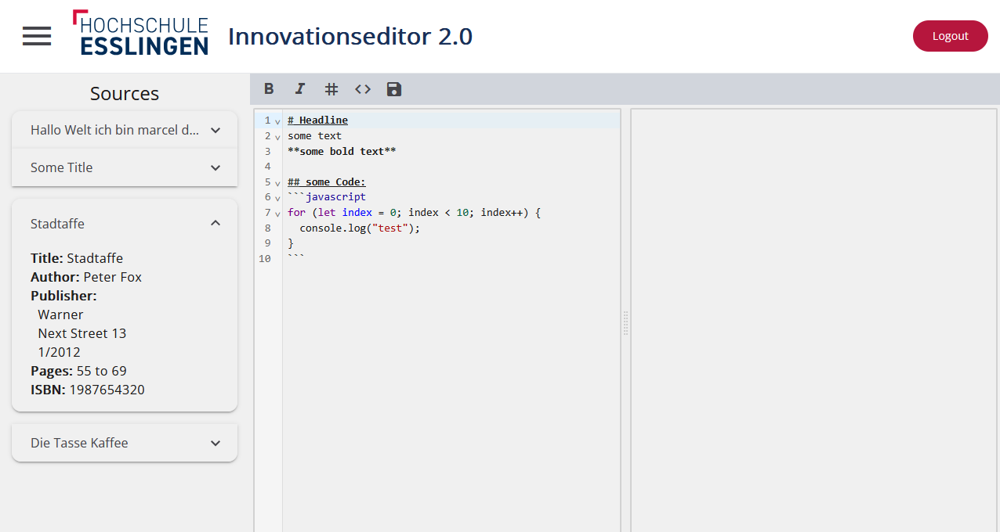

*Abbildung 8.1: Editor Prototyp*

Die Abbildung 8.1 zeigt einen Screenshot des Editor Prototyps. Das generelle Layout der Komponenten wird sich im weiteren Verlauf nicht mehr grundlegend ändern. Das Design der Seite orientiert sich an unserer Vision, wird aber in Zukunft angepasst und erweitert. Die aktuell verfügbaren Funktionen umfassen einen Login über Keycloak (hier nicht abgebildet), den mittels *Codemirror* integrierten Editor, eine Shortcut-Leiste sowie eine Sidebar mit den von Usern hinterlegten Quellen.

Der Editor verwendet Markdown und unterstützt Syntax-Highlighting sowie typische Funktionen wie Undo und Redo. Die Shortcut-Leiste ermöglicht schnellen Zugriff auf Textformatierungen wie beispielsweise kursiven Text. Die Sidebar zeigt hinterlegte Quellen, die per Drag-and-Drop an eine gewünschte Stelle im Editor platziert werden können. Zudem kann die Sidebar über den Button oben links aus- und eingeblendet werden.

### 8.2 Finaler Projektstand

Zum Zeitpunkt des Projektabschlusses aus Sicht des Moduls *Projekt Softwaretechnik und Medieninformatik* umfasst das Projekt IT-Innovationseditor V2.0 folgenden Stand:

#### 8.2.1 Struktur

Abbildung 8.2 bildet die Ordnerstruktur des Frontends ab. Unter `src/app` befindet sich der Code, der das Frontend steuert. Die Struktur ist für die Verwendung von Angular gängig aufgebaut.

- Der `_components`-Ordner umfasst alle Komponenten der App. Ganze Ansichten der App werden jedoch separat im `_views`-Ordner abgegrenzt, da es sich bei ihnen in der Regel um Kompositionen mehrerer Komponenten handelt.
- Interfaces werden analog zum Backend im Ordner `_models` definiert.
- Der `_services`-Ordner beinhaltet den Großteil der Logik für die entsprechenden Komponenten. Hierzu gehören beispielsweise die Funktionen des Editors sowie die Anbindungen an das Backend zum Abfragen, Erstellen, etc. von Artikeln, Quellen und Bildern.

Zusätzlich bestehen weitere Ordner und Dateien, die für die Funktion eine Rolle spielen:

- Um verschiedene Umgebungen zu unterstützen, werden im `environments`-Ordner Variablen für verschiedene Umgebungsprofile, wie beispielsweise ein `dev`-Profil, definiert. Diese Variablen werden, wie es in der `angular.json` definiert wurde, abhängig des Build-Profils ausgetauscht. Analog dazu besteht eine `.env`-Datei, welche die Umgebungsvariablen für die Konfigurationsdateien enthält.
- Die `nginx.conf` ist die zentrale Konfigurationsdatei von Nginx. In ihr wird definiert, wie der Webserver Anfragen entgegennimmt, verarbeitet und ausliefert. Hierzu gehören Ports, Domains, Dateipfade, Routing-Regeln, Proxys, Cashing, Security, etc.
- Die `Dockerfile` beschreibt Schritt für Schritt, wie ein Container-Image erstellt werden soll.

```
└── /src
    └── /app
        └── /_components
            └── /_views
        └── /_models
        └── /_services
    └── /environments
    └── /styles
    ├── index.html
    ├── main.ts
    └── styles.scss
├── .env
├── Dockerfile
├── LICENSE
└── nginx.conf
```

*Abbildung 8.2: Frontend-Struktur*

### 8.3 Technologische Entscheidungen

Relevante Entscheidungen für das Frontend werden folgend beschrieben.

**Verwendete Bibliotheken**

- **Codemirror** ist eine moderne, modulare Editor-Komponente für den Browser, die eine anpassbare UI bereitstellt. In diesem Projekt wurde CodeMirror-6 verwendet.
- **@codemirror/lang-markdown** liefert eine Markdown Sprachunterstützung für Codemirror. Sie ermöglicht einfaches Highlighting, Tokens und erlaubt das Einklappen von Sektionen im Editor.
- **@codemirror/language-data** stellt zusätzliche Sprach-Profile bereit.
- **@ngx-translate/core** ermöglicht die Internationalisierung (i18n) von Angular-Anwendungen, indem Übersetzungen zur Laufzeit geladen und über Services sowie Pipes in der UI verwendet werden können.
- **@ngx-translate/http-loader** für das Laden von JSON-Dateien für `@ngx-translate/core`. In diesem Projekt werden Übersetzungen unter `public/i18n/*.json` bereitgestellt.
- **angular-oauth2-oidc** ermöglicht die Verwaltung von Logins und entsprechenden Tokens. Sie erweitert das Frontend um Authentifizierungs- und Autorisierungs-Features wie den Login, Token-Refresh und gesicherte API-Anfragen.
- **angular-split** stellt ziehbare Split-Layouts bereit, die für den Editor und die Vorschau verwendet wurden.
- **tailwindcss** (benötigt `@tailwindcss/postcss` und `postcss`) wird genutzt, um UI-Layouts direkt über HTML-Dateien mittels Utility-Klassen zu stylen, anstelle separater CSS-Dateien mit komponentenspezifischen Styles.
- **@angular/material** stellt Komponenten wie Buttons, Dialogs, Inputs und Toolbars zur Verfügung. Durch die Verwendung dieser Komponenten kann eine konsistente UI gemäß den Material Design Guidelines sichergestellt werden.

**Angular Setup**

Das Angular-Setup basiert auf einer modernen Angular-Version (20), um aktuelle Features wie Signals nutzen zu können. Für das Styling wird SCSS eingesetzt, was insbesondere den Umgang mit `@angular/material` vereinfacht, da Design-Tokens, Variablen und Mixins zentral definiert und wiederverwendet werden können. Zusätzlich wird ein „zoneless"-Ansatz verwendet, der mit Angular 17+ möglich ist. Dadurch wird die Change-Detection gezielt optimiert, unnötige Aktualisierungen werden vermieden und die Gesamtperformance der Anwendung weiter verbessert.

**Client-Side Rendering**

Beim Client-Side Rendering läuft der Editor vollständig im Browser auf dem Endgerät des Nutzers. Dadurch werden die meisten Interaktionen, wie das Schreiben von Markdown/Latex oder das Navigieren im Editor, lokal verarbeitet, was zu sehr schnellen Reaktionszeiten führt. Dies reduziert außerdem nicht nur die benötigten Serverressourcen, sondern senkt auch die Kosten für Skalierung. Insgesamt profitiert der Nutzer von einer deutlich besseren Performance und einer flüssigeren Bedienung des Editors.

### 8.4 Implementierte Features

- User können sich anmelden
- Artikel können erstellt werden
- Grafiken und Quellen können hochgeladen werden
- Flag für vertrauliche Inhalte kann gesetzt werden
- Professoren und Professorinnen können einem Artikel zugewiesen werden
- Der Status eines Artikels kann eingesehen werden
- Code-Blöcke können eingefügt werden
- Syntax-Highlighting für Bilder, Quellen und Referenzen im Editor
- Hilfeseite kann ausgeklappt werden
- Editor-Funktionen können über Shortcuts verwendet werden

### 8.5 Finales Layout und Design

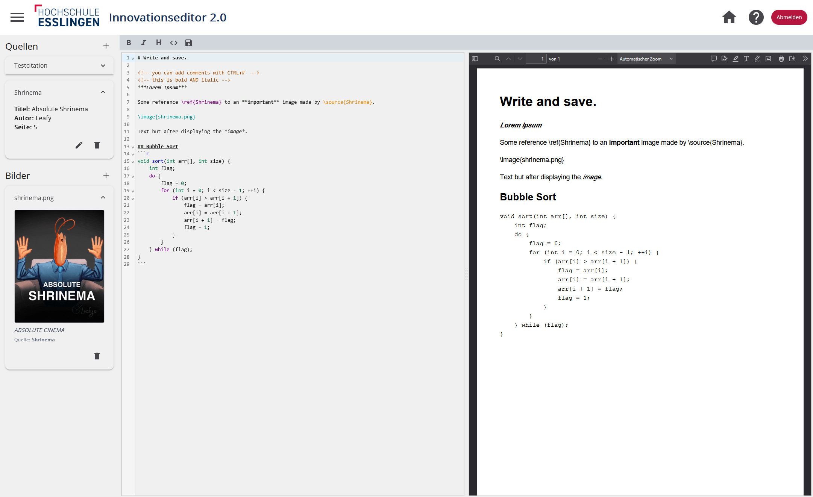

*Abbildung 8.3: Editor Final*

Die Abbildung 8.3 zeigt einen Screenshot des finalen Editors. Im Vergleich zum Prototypen erkennt man hier einige der oben aufgeführten implementierten Features. In der Sidebar werden neben den Quellen auch Grafiken angezeigt und können vom User manuell hinzugefügt und editiert werden. Die PDF-Vorschau verwendet den vom Browser bereitgestellten PDF-Viewer und zeigt die vom Backend zurückgegebene Datei, die aus dem Inhalt des Editors generiert wurde. Oben rechts befindet sich ein Home-Button, der den User zurück zur Übersicht der eigenen Artikel leitet. Daneben befindet sich ein Button, der die Hilfeseite ausklappt. Sie bietet Informationen zum Styleguide und nützlichen Funktionen wie Shortcuts.

---

## 9 Backend

In diesem Kapitel werden die Komponenten des Backends betrachtet. Hierbei getroffene Entscheidungen werden für die Nachvollziehbarkeit dokumentiert.

### 9.1 Prototyp

Die API-Schnittstelle des Backends liefert, wie in Abbildung 9.1 und 9.2 dargestellt, bei einer GET-Anfrage zum Abruf der Userdaten die User-ID sowie den vollständigen Namen zurück. Weitere Informationen werden separat über Keycloak abgefragt. Zu diesem Zweck wird in der Datenbank die Keycloak-UUID gespeichert.

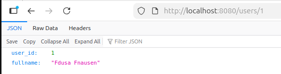

*Abbildung 9.1: Get-Response für User mit ID 1*

Ist die angefragte User-ID nicht in der Datenbank vorhanden, gibt das System eine „404 Not Found" Antwort mit einer individuellen Fehlermeldung zurück (siehe Abbildung 9.2).

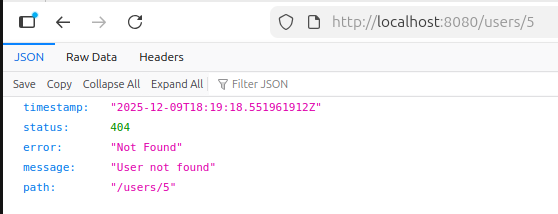

*Abbildung 9.2: Get-Error für den User ohne ID in der Datenbank*

#### 9.1.1 Struktur

Die Schnittstellen zum Client werden durch die *Controller*-Klassen gebildet. Diese greifen auf Services zurück, welche die eingehenden Anfragen verarbeiten, Aufgaben an weitere Komponenten delegieren und die entsprechenden Antworten zusammensetzen. Mithilfe von Daten Transfer Objekten (DTOs) wird der Informationsfluss nach außen kontrolliert, sodass sensible Daten vor nicht autorisierten Usern verborgen bleiben. Mapper-Interfaces übernehmen die Datenübergabe zwischen DTOs und Entitäten. Entitäten repräsentieren dabei die Datenobjekte in der Form, in der sie in der Datenbank persistiert werden.

Die Repository-Klassen interagieren direkt mit der Datenbank und werden von den Services genutzt, um Daten aus Anfragen zu speichern oder zur Beantwortung von Anfragen abzurufen. Können Anfragen nicht erfolgreich verarbeitet werden, werfen die Services oder DTOs spezifische Exceptions mit Hinweisen auf die jeweilige Ursache. Diese werden unter anderem von einem globalen Exception-Handler abgefangen, der entsprechende HTTP-Antworten an den Controller zurückliefert.

Die einzelnen Klassen werden entsprechend ihrer Funktion in Ordnern strukturiert, sodass sich beispielsweise Request- und Response-Klassen eindeutig voneinander unterscheiden lassen. Alternativ kann die Struktur domänenorientiert erfolgen, wobei sämtliche Interfaces und Klassen zu einer Entität in einem gemeinsamen Ordner zusammengefasst werden.

### 9.2 Finaler Projektstand

Zum Zeitpunkt des Projektabschlusses aus Sicht des Moduls *Projekt Softwaretechnik und Medieninformatik* umfasst das Projekt IT-Innovationseditor V2.0 folgenden Stand:

#### 9.2.1 Struktur

Das Backend ist, wie in Abbildung 9.3 zu sehen, folgendermaßen aufgebaut: im `main`-Ordner befindet sich der Backend-Code, aufgeteilt nach Funktion.

- Die **DTOs** sind nach Anfrage (`request`) und Antwort (`response`) sortiert und werden für das Verstecken von Werten genutzt, die sensibel sind.
- Die Logik zum Abfangen und Werfen lokal definierter **Exceptions** befindet sich in dem gleichnamigen Ordner. Diese werden auch für die HTTP-Fehler-Antworten verwendet.
- Die **Mapper** übertragen die Attribute der Entitäten auf die der DTO und umgekehrt.
- Im Ordner **models** sind die Entitäten definiert.
- **Repositories** sind den Entitäten zugeordnete Klassen, welche mit SQL-Anfragen Daten aus der PostgreSQL Datenbank bekommen, um diese dem Backend zur Verfügung zu stellen.
- Die Sicherheitslogik zum Abfangen unerwünschter Zugriffe und Unterscheidung der implementierten Rollen in Keycloak befindet sich im Ordner **security**.
- **Services** rufen andere Klassen im Backend auf, um auf Anfrage die Antwortdaten zusammenzustellen und geben das Antwortpaket an die Controller weiter.
- `Application.java` ist die Startklasse des Backends.
- Unter **resources** befinden sich die Konfigurationsdateien mit der Endung `.properties`.
- Im **Testordner** werden Testdateien angelegt. Dieser ist leer, da keine Tests erstellt wurden.
- Die `.env` Datei enthält die Umgebungsvariablen des Backends.
- Das **Dockerfile** generiert beim Ausführen einen Container, in dem das Backend systemunabhängig laufen kann.
- In der **LICENSE-Datei** ist die Lizenz aufgeführt, unter welcher das Backend steht.
- Die **pom.xml-Datei** listet die externen Abhängigkeiten des Backends und definiert wann diese geladen werden (z.B. Kompilieren oder Testen).

```
src/
├─ main/
  ├─ java/*/
    ├─ controller/
    ├─ dto/
      ├─ request/
      └─ response/
    ├─ exceptions/
    ├─ mappers/
    ├─ models/
    ├─ repositories/
    ├─ security/
    ├─ services/
    └─ Application.java
  └─ resources/
    └─ application.properties
└─ test/
.env
Dockerfile
LICENSE
pom.xml (Abhängigkeiten)
```

*Abbildung 9.3: Backend-Struktur*

#### 9.2.2 Querschnitt

Wird eine API-Schnittstelle des Backends aufgerufen, so übernimmt der entsprechende Controller die Verarbeitung der Anfrage und ruft den zuständigen Service auf. Innerhalb des Services werden die übergebenen Parameter verarbeitet, benötigte Ressourcen über die *Repository*-Klassen aus der Datenbank geladen und anschließend zu einer Antwort zusammengestellt. Die vom Service zurückgegebenen Ergebnisse werden vom Controller entgegengenommen und als Antwort auf den API-Call an den Client weitergeleitet.

### 9.3 Technologische Entscheidungen

Relevante Entscheidungen für das Backend werden folgend beschrieben.

**Allgemeine Entscheidungen**

Die Ordnerstruktur wurde in Absprache mit dem Team domänenorientiert strukturiert.

**Entitäten**

Für die Implementierung der Entitäten wurde die Bibliothek **Lombok** eingesetzt, um die automatische Generierung von *Getter*- und *Setter*-Methoden zu ermöglichen. Dadurch bleiben die Klassen schlank, übersichtlich und frei von sich wiederholendem Code.

**Daten Objekte**

Zur Annahme und Rückgabe von Daten an den Client wurden DTOs verwendet, um sensible Informationen nicht nach außen preiszugeben. Die Übertragung der Daten zwischen DTOs und Entitäten erfolgt über *Mapper*-Klassen unter Verwendung der Bibliothek **MapStruct**.

**Service und Controller**

Die Übergabe von Daten zwischen den *Service*- und *Controller*-Klassen wurde zu Projektbeginn nicht definiert und ist dementsprechend in unterschiedlichen Varianten umgesetzt worden. Im Rahmen eines Code-Reviews gegen Ende des Projektzeitraums wurde beschlossen, die bisher in den Services erzeugten HTTP-Antwortentitäten in die Controller zu verlagern. Die fachlichen Rückgabedaten sollen dabei als `Optional`-Objekte übergeben werden, sodass die eigentliche Antwortlogik im Controller durch Prüfung der `Optional`s erfolgt. Diese Umstellung wurde bislang noch nicht umgesetzt.

**Exceptions**

Für die Kommunikation von Fehlern im Backend mittels HTTP-Status wurden spezielle Exception-Klassen erstellt. Eine globale `GlobalExceptionHandler`-Klasse fängt zur Laufzeit geworfene Exceptions ab und gibt eine HTTP-Antwort mit Fehler-Status zurück.

**Verwaltung von Binärdaten (Bilder)**

Für das Hochladen und Anzeigen von Bildern wurde eine Lösung implementiert, die das Dateisystem und die Datenbank verknüpft.

- **Upload:** Bilder werden als `MultipartFile` an den `ImageController` gesendet. Das Backend generiert eine UUID, speichert die Datei physisch im `uploads/`-Ordner des Servers und legt einen Metadaten-Eintrag (Dateiname, Pfad, MIME-Type) in der Datenbank ab.
- **Download/Anzeige:** Um Bilder im Frontend anzuzeigen, wurde der Endpoint `GET /articles/{id}/images/{id}/content` geschaffen. Dieser validiert die Zugehörigkeit des Bildes zum Artikel und streamt anschließend die Datei als Resource mit dem korrekten MIME-Type an den Browser zurück.

**JSON Naming Strategy**

Das Projekt verwendet global die `SNAKE_CASE` Strategie für JSON-Objekte (z.B. `article_id`), um Datenbank-Konventionen zu entsprechen. Das Frontend (Angular) verwendet jedoch standardmäßig `camelCase`. Um Inkonsistenzen zu vermeiden, wurde in spezifischen DTOs (z.B. `ImageResponseDTO`) mittels der Jackson-Annotation `@JsonProperty("camelCaseName")` explizit definiert, wie die Felder serialisiert werden sollen. Dies erspart dem Frontend aufwendige Mapping-Logik und sorgt für eine saubere Schnittstelle.

### 9.4 Sicherheit und Authentifizierung über Keycloak

Das System verwendet Keycloak als externen Authentifizierungs- und Autorisierungsservice. Hierfür wurden im Keycloak-Client zwei separate Clients angelegt: einer für die Produktion und einer für die Entwicklung. Jeder Client ist mit vier Rollen ausgestattet:

- `ADMIN`
- `EDITOR`
- `DEKANAT`
- `USER`

Alle User sind darüber hinaus Mitglieder einer gemeinsamen Systemgruppe. Die in Kapitel 2 beschriebenen Personas werden durch die in Keycloak definierten Rollen abgebildet. Die Administrierenden entsprechen der Rolle `ADMIN`, die Studierenden der Rolle `EDITOR`, das Dekanat der Rolle `DEKANAT` sowie die Professoren und Professorinnen der Rolle `USER`. Diese Zuordnung ermöglicht eine klare Trennung der Rechte.

*Tabelle 9.1: Zuordnung der Personas zu Keycloak-Rollen und Benutzern*

| Persona | Rolle | Zugeordneter Benutzer |
|---------|-------|-----------------------|
| Administrierende | ADMIN | admin@example.de |
| Studierende | EDITOR | demo@example.de |
| Dekanat | DEKANAT | dekanat@example.de |
| Professoren und Professorinnen | USER | test@example.de |

Die Rolleninformationen werden aus einem JSON Web Token (JWT)-Token extrahiert, das Keycloak nach erfolgreicher Authentifizierung des Benutzers ausstellt (siehe Tabelle 9.1). Bei jeder Anfrage an das Backend wird dieses Token vom Browser, in dem die Single-Page-Application (SPA) läuft, im Authorization-Header mitgesendet. Die genaue Abfolge des Token-Flusses ist in Kapitel 5 unter der Laufzeitsicht beschrieben. Da unser System stateless arbeitet, werden keine Server-Sessions gespeichert. Daher wurde Cross-Site Request Forgery (CSRF)-Schutz deaktiviert. Gleichzeitig ist Cross-Origin Resource Sharing (CORS) aktiviert, um Anfragen vom Frontend an das Backend zu ermöglichen.

Die Autorisierung sollte auf Basis der im JWT enthaltenen Rollen erfolgen und über die Spring-Security-Konfiguration umgesetzt werden. Aufgrund zeitlicher Einschränkungen wurde diese Funktionalität jedoch nicht implementiert. Keycloak implementiert OpenID Connect (OIDC) auf Basis von OAuth 2.0. Dadurch kann das Backend die Identität des Users sicher verifizieren, ohne Passwörter zu speichern und die Informationen des Users über das ID-Token abzurufen. Das Access-Token ermöglicht es, autorisierte API-Zugriffe durchzuführen, während ein optionales Refresh-Token vom Frontend genutzt wird um ein neues Token anzufordern, sobald das Access-Token abläuft.

### 9.5 Implementierte Features

- Applikationen können die Backend-API über HTTP-Anfragen aufrufen
- Speichern von Entitäten in der PostgreSQL Datenbank
- Laden von Entitäten über die API mit vor Usern versteckten sensiblen Daten
- Grafiken können im Backend gespeichert und abgerufen werden
- Bei einer Anfrage für die PDF-Ansicht wird der gespeicherte Text im Backend zu einer PDF konvertiert und diese an das Frontend zurückgegeben
- Verifizieren des JWT im Backend mit Hilfe des verbundenen Keycloak-Servers

---

## 10 Installationsanleitung

Die Installationsanleitung befindet sich als Markdown-Dokument in GitHub.

**Mögliche Verbesserung**

Für eine einfachere Installation müssen die Umgebungsvariablen aus dem Frontend und Backend aus dem Setup geholt werden, sodass nur die `.env.example` Datei im Setup angepasst werden muss.

---

## 11 Reflektion

Dieses Kapitel beschreibt das rückblickende Verhalten und die Arbeitsweise der Projektgruppe.

### 11.1 Projektmanagement und Gruppendynamik

Die Gruppenorganisation und -kohäsion waren zu Beginn des Projekts gering ausgeprägt und nahmen im weiteren Verlauf eher ab. Aufgrund der unterschiedlich verteilten Vorlesungen der Gruppenmitglieder gestaltete sich die Terminfindung schwierig. Dies führte zu einer geringeren Anzahl an Teammeetings als ursprünglich geplant und erschwerte die Abstimmung innerhalb der Gruppe. Auch das organisatorische Engagement ließ im Verlauf des Projekts immer mehr zu wünschen übrig. Die allgemeine Stimmung innerhalb der Gruppe war überwiegend neutral, was zwar Spannungen verhinderte, jedoch die Motivation erschwerte. Die Einarbeitung in die verwendeten Frameworks und Technologien nahm einen erheblichen Teil der verfügbaren Arbeitszeit in Anspruch, da das Team zu Projektbeginn nur wenig Erfahrung in diesen Bereichen hatte.

### 11.2 Zeitmanagement

Ein effektives Zeitmanagement wurde durch zahlreiche parallel stattfindende und zeitintensive Labore erschwert. Dies machte sich insbesondere gegen Ende des Semesters bemerkbar, da zusätzlich Zeit für die Prüfungsvorbereitung eingeplant werden musste. Die nachträgliche Auflistung der investierten Arbeitszeit gestaltete sich schwierig, da diese während des Projektverlaufs nicht systematisch erfasst wurde.

### 11.3 Frontend

Die Zusammenarbeit am Frontend hat sich schwerer als gedacht gestaltet. Die große Erfahrungsdifferenz im Frontend Development erschwerten eine effiziente Aufgabenverteilung.

### 11.4 Backend Code

Das Backend weist unterschiedliche Codestile auf und muss im Nachgang vereinheitlicht werden. Aufgrund fehlender Absprachen und der nicht konsequenten Einhaltung von Richtlinien existieren mehrere Implementierungsvarianten im Backend-Code, abhängig vom jeweiligen Entwickler. Diese Problematik wurde zwar im Rahmen eines Code-Reviews identifiziert, konnte jedoch aus zeitlichen Gründen bislang nicht behoben werden.

### 11.5 Tests

Aufgrund von Zeitmangel wurden nur wenige automatisierte Tests implementiert. Der einzige automatisierte Test wird als GitHub-Action ausgeführt und nutzt den Befehl `./mvnw verify` um sicherzustellen, dass der aktuelle Stand des Projekts erfolgreich kompiliert.

Rückblickend hätten Tests insbesondere am Projektende dazu beigetragen, Fehler schneller zu identifizieren und den entsprechenden Codeabschnitten zuzuordnen.

### 11.6 Lessons Learned

Eine klare Rollenverteilung, beispielsweise durch die Benennung eines Teamleiters, hätte das Projektteam organisatorisch unterstützen können. Dadurch hätten Aufgaben besser koordiniert und Entscheidungen verbindlicher umgesetzt werden können.

Das Lernziel hat das Projektteam jedoch in jeder Hinsicht erreicht. Neben den eingesetzten Technologien, die für den Einsatz erlernt wurden, verbesserte das Team auch die Fähigkeit Zwischenergebnisse zu präsentieren und die Arbeitszeit besser abzuschätzen. Zudem wurde ein Server verwendet um die lauffähige Anwendung in einer produktionsnahen Umgebung zu testen.

### 11.7 Nutzung von generativer KI

Hier wird aufgeführt, wie und in welchem Umfang generative Künstliche Intelligenz (KI) beim Entwicklungsprozess und dokumentieren eingesetzt wurde.

**Dokumentation**

Bei der Erstellung der Dokumentation wurde KI, insbesondere zur sprachlichen Überarbeitung und Umformulierung von Textpassagen, unterstützend eingesetzt. Dadurch konnten Formulierungen präzisiert, Redundanzen reduziert und ein einheitlicher, verständlicher Schreibstil gewährleistet werden.

**Code**

Der Einsatz von KI im Bereich der Softwareentwicklung erfolgte bewusst unterstützend. KI wurde zur Codeanalyse genutzt, um potenzielle Fehlerstellen schneller zu identifizieren und Hinweise auf mögliche Ursachen zu liefern. Die finale Bewertung sowie die Entscheidung über notwendige Änderungen blieben dabei stets beim Entwicklungsteam.

Darüber hinaus unterstützte KI bei der Analyse und Erklärung von Bugs unter anderem anhand von Stacktraces. Dadurch konnten Fehlermeldungen besser nachvollzogen und Zusammenhänge im Code schneller verstanden werden, ohne die eigenständige Fehlersuche zu ersetzen.

Beim Refactoring wurde KI unterstützend eingesetzt, um einerseits dateiübergreifend durch gezielte Prompts eine Vereinheitlichung des Codes zu erreichen. Andererseits wurden von der KI vorgeschlagene Umstrukturierungen oder Verbesserungen sorgfältig geprüft und umgesetzt. Auf diese Weise diente KI als Hilfsmittel zur Qualitätssicherung, jedoch nicht als automatisierter Ersatz für fundierte Entwicklerentscheidungen.

---

## 12 Ausblick

Im Ausblick werden Features erfasst, die aus zeitlichen Gründen oder aufgrund zu hoher Komplexität als Out-of-Scope definiert wurden, sowie solche, die während des Projekts als Ideen entstanden sind oder in einer Fortführung des Projekts aufgegriffen werden können.

### 12.1 PDF-Worker

Aufgrund des zusätzlichen Aufwandes für die grundlegende Projektstruktur wurde eine stark reduzierte Version des PDF-Workers implementiert. Die Message-Queue auf Basis von RabbitMQ ist bereits implementiert, sodass lediglich ein zusätzlicher Microservice entwickelt werden musste, der die Nachrichten aus der Queue zieht, den Markdown-Text in eine PDF umwandelt und diese in eine separierte Antwort-Queue legt. Aktuell werden Quellen nicht berücksichtigt und Bilder werden als URL dem Markdown-Text hinzugefügt.

### 12.2 Style-Sheet

Die Layout-Einstellungen für die Kurzfassungen könnten in einem separaten, zentralisierten Style-Dokument festgehalten und bearbeitet werden.

### 12.3 Admin-Seiten

Seiten für die Nutzerverwaltung wurden schon relativ früh depriorisiert, da der Fokus auf dem Editor liegen sollte.

### 12.4 Reviewer-Seiten

Eine Übersichtsseite über die Artikel und Studierenden, sowie eine Seite, welche die ausgewählten Artikel anzeigt, wurden nicht implementiert. Dieses Feature war für die Dozenten-/Reviewer-Rolle vorgesehen.

### 12.5 Dekanat-Seiten

Um die Präambel zu verfassen, kann die Artikel-Seite für den Dekan erweitert werden. Hierbei soll für jeden Bearbeitungszeitraum eine Präambel erstellbar sein.

### 12.6 Hibernate Softdelete

Für das Löschen von Daten wurde während des Projektes die Option eines Softdeletes besprochen. Die Bibliothek Hibernate bietet diese Funktion, somit könnte diese mit geringerem Aufwand umgesetzt werden.

Bei einem Softdelete werden die gelöschten Daten in der Datenbank behalten und als gelöscht markiert, so könnten Aktionen rückgängig gemacht oder besser nachvollzogen werden.

---

## Literaturverzeichnis

[1] OpenAI, „Digital Portrait: Personas," Erstellt mit ChatGPT (GPT-5) und DALL·E, OpenAI, 2025, KI-generiertes Bild, erstellt am 19. Oktober 2025. [Online]. Verfügbar unter: https://chat.openai.com
